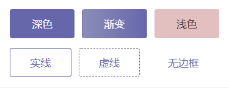
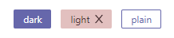

# 色彩

说到色彩，作为非设计专业理工人，是不敢瞎造次的。

这里不得不提到的就是 [Ant Design](https://ant.design/docs/spec/colors-cn)，它是我见过的好好搞色彩的大众 UI 库了，已经演化出 3 个版本了，具体可以看这篇文章 [Ant Design 色板生成算法演进之路](https://zhuanlan.zhihu.com/p/32422584)。

秉承着开源精神， 组件库使用了 Ant Design 的色卡算法，同时加入了一点自己的思考。

## 默认主题

我们采用了传统组件库类型系统，分为 `default`, `primary`, `success`, `warning`, `danger` 五种类型，分别有五种色彩对应。

其中 `default` 直接复用了 Ant Design 灰度色卡，其他颜色则是选取了符合 WCAG 的 AA 级标准的色值。

| type    | color   |
| ------- | ------- |
| primary | #125c9b |
| success | #057748 |
| warning | #96480c |
| danger  | #b2252e |

如果想要自定义主题色彩，可查看[主题定制](../guide/theme.md) 。

## 自定义色彩

前面提到了 Ant Design 的色卡算法，在部分组件都有相应的应用，比如 `Button`, `Tag`, `NoticeBar`, `Badge`, `Avatar`。

除了主题自带的四种颜色，同时也支持单独颜色自定义，和其他 UI 库 不同的是，只需要传入一种颜色就可以完成整个组件的效果渲染。如：2022 年流行色 **长春花色** 和 **莲花色**。

`Button` :

`Tag` :

`NoticeBar` :

上图展示深色组件和浅色组件的呈现效果。

只要传入一个主要颜色，组件内置算法会帮你算出其他配套的色彩，包括不限于背景色，前景色，渐变色，点击态，深色浅色区分等。

### 颜色值格式

颜色值的要求也是比较宽泛，除了最简单的 hex，如 `#ffffff`，其他的 `rgb(255, 255, 255)`，`hsl(0deg, 0%, 0%)` 等 CSS 支持的规范也可以支持。

主要得益于引入了一个颜色库 [colorfuls](https://github.com/godxiaoji/colorfuls)，没错，这也是我写的。其他像非 WEB 的格式如 `HSB`, `CMYK` 也是可以的，详见其文档。

当然在自定义色彩这里，是忽略不透明值的。
