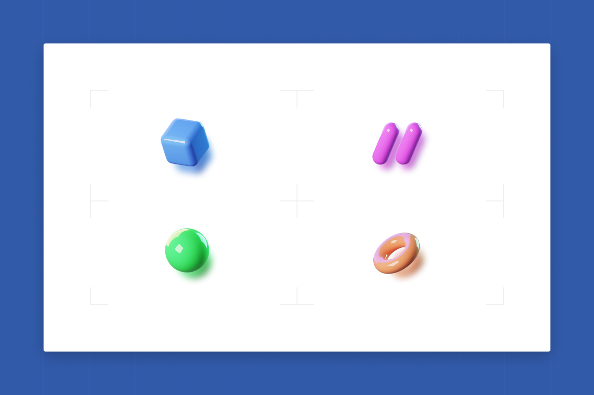
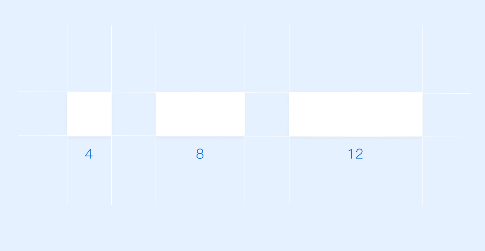
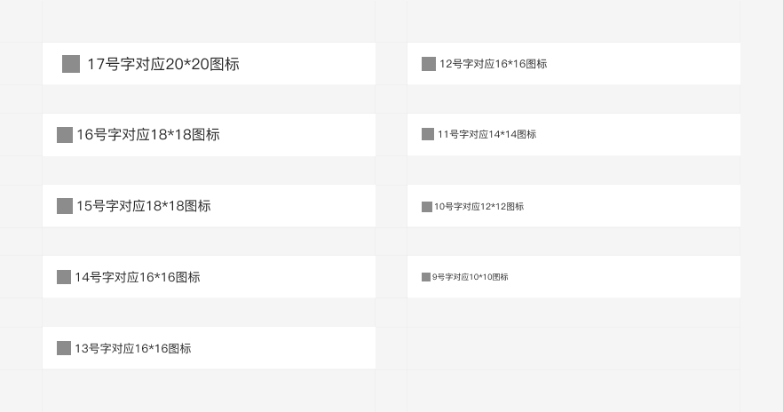

# 设计

设计的本质是解决问题，而在每个项目的设计中，不可避免的会与各个不同的角色互动：不同的设计师、不同的前端工程师，这其中不可避免的会出现大量的沟通和协作问题，如何在这类多角色互动中提高效率，降低沟通损耗就不可避免的成为一个问题。「组件化」可以在某些层面帮助我们更好的解决这个问题。在复用和设计过程中，与 Brad Frost 提出的  Atomic Design （原子设计）有相似之处。

该组件库便是在项目中实现 **可复用** 、 **一致性** 、 **高效率** 的目标之下孕育而生的。

## 设计思路：从限制到规范

针对不同平台的设计会面对不同的限制，而事实上几乎所有的设计都是在一定的限制之下，而此移动端组件库的设计同样如此，在设计中需要发现最小的限制，包括核心字号、最小间距单位，并基于此进行设计，才能在最后的呈现中保证所体现的效果。

## 布局

### 基本元素

在此组件库的样式设计中，最基本的元素为文字。原因在于，不同的平台在呈现层最显著的差异首先变是呈现视图的大小，这通常对应于屏幕的像素量与尺寸，而以上的两点便决定了文字需要多大才能使用户能够清晰快速地辨认，在确定了文字的合适区间之后，便可定义出之后一系列的相关尺寸，最后得出整体布局。

**核心常用字号。** 通过对常用 APP 的字号调研，发现当前的移动端核心常用字号范围为 15pt、16pt、17pt。为了兼容更多年龄群体的使用体验，使组件能够在可及性上有更好的保证，本组件库选择了 **17pt** 字号作为核心常用字号。然后以此字号进行一定的向下波动，以应对不同的场景和组件。

### 间距

#### 基本间距单位

在定义好了基本元素之后，便可对间距进行定义。本组件库的设计中，每一个基本间距变动单位为 4，即当一个元素需要确定与相邻元素的距离时，其选择的距离应尽可能为 4、8、12、16、20、24、28、32......

#### 间距参数的确定：视觉与理性

在确定了核心字号与基本间距单位之后，针对具体不同的组件，都会涉及不同的间距选择。而这便需要通过视觉感受与理性推导的结合来选择合适的间距。

#### 从基本组件到组件库

本组件库的间距体系起始于最基本的单个组件——单元格（Cell），通过对其的设计参数的确定，进而确定整个组件库的核心间距数值。

首先基于所选取的核心字号 17pt，确定其空间高度为 24pt，进而由其高度的一半确定文本与上下边界的距离为 12；又由文本与视图边界的关系应弱于其与上下关联元素的关系，因此确定了此间距为 16（12+4，即竖向元素的间距加一个间距单位）。

由此得出了组件库中的左右留白间距，即为 16。此组件库中其他间距确定也与此类似。

## 视觉细节

### 图标

图标用以辅助界面信息的呈现，因此图标的大小也由字高而来，以保证图标的视觉大小同相近单个文字，使其具有一贯性。

### 圆角

本组件库中出现的圆角主要为 2、4、8，其中以 4 的圆角为基准，2 圆角用于界面中的小元素，8 圆角用于界面中的大元素和超大元素。

## Figma 组件库

[Figma](https://www.figma.com/file/R7SiJrftLA0Dv2VAXcZg2U/Vfox-UI?node-id=14%3A2)
