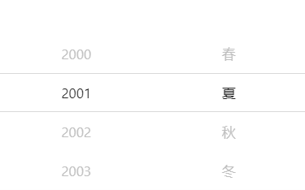
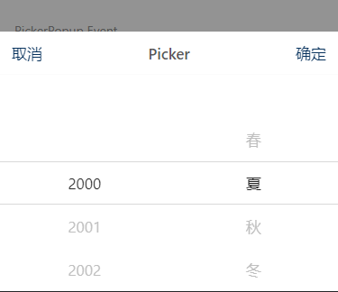
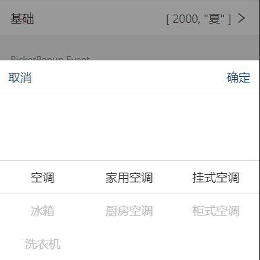

# 渐进式组件

在选择器这块，为了突出特色，做了一定的梳理，演变成了 **view -> popup -> selector** 三个独立组件，他们的功能都有 `v-model` 和 `change` 事件作为数据的绑定，但是不同的展现形式可以运用到不同的场景中。

## View 选择面板

直接将选择内容展示出来。

以 `PickerView` 为例子：

## Popup 选择弹窗

把选择面板包装成弹窗，通过 `v-model:visible` 控制弹窗的展示和隐藏。

以 `PickerPopup` 为例子：

## Selector 选择器

把选择弹窗和 input 关联， 更适用于表单中的场景。

以 `Picker` 为例子：

## 目前支持渐进式的组件有：

- [Calendar](../components/Calendar.md)
- [DatePicker](../components/DatePicker.md)
- [Cascader](../components/Cascader.md)
- [Picker](../components/Picker.md)
